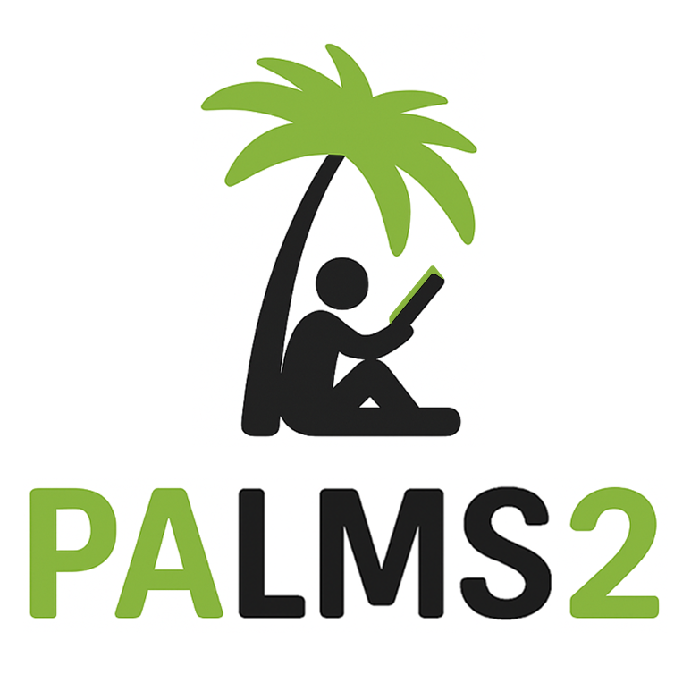

# System for Monitoring Students Projects Milestones

This repository contains the **System for Monitoring Students Projects Milestones** — a solution designed to facilitate the planning, supervision, and evaluation of academic projects in educational institutions.

As part of this project, an existing system called [PaLMS (v1)](https://github.com/sefasenlik/PaLMS) — *Project Administration and Learning Management System* — was extended and improved. The enhanced version is named **PaLMS 2** and is now a fully featured module for managing student academic workflows.

In addition, this repository includes a separate module **Decidely**, which allows you to conduct surveys among selected poll users. When PaLMS 2 is installed, Decidely integrates with it to conduct surveys of professors for assignment to committees, but Decidely can also be used independently.

---

## Modules Overview

### PaLMS 2 — Project Administration and Learning Management System

<div style="text-align: center;">
  
</div>

#### Features

- **Student Workflows**:
  - Submission of project proposals and applications
  - Tracking project progress through milestones
  - Access to dashboard views, event calendars, and announcements

- **Academic Supervision**:
  - Assigning students and supervisors to projects
  - Reviewing milestone submissions with feedback and assessments
  - Viewing individual and aggregated progress

- **Commission and Review**:
  - Managing the schedule of defenses and project grading 
  - Organizing commission meetings and members
  - Handling review tables and reviewer assignments

- **Administration and Configuration**:
  - Managing faculties, programs, tags, campuses, scientific profiles
  - Ability to import and export entity information in csv format

---

#### Project Structure

```
student/
├── data/
│   ├── import/
│   │   └── student_degree.xml
│   ├── company_details.xml
│   ├── student_email_templates.xml
│   └── ...
├── i18n/
│   └── ru.po
├── models/
│   ├── __init__.py
│   ├── custom_poll.py
│   ├── custom_project.py
│   ├── student_project.py
│   ├── student_milestone.py
│   └── ...
├── security/
│   ├── ir.model.access.csv
│   └── ir_group_inherit_export.xml
├── static/
│   └── description/
│       └── icon.png
├── views/
│   ├── custom_poll_views.xml
│   ├── custom_project_views.xml
│   ├── student_project_views.xml
│   ├── student_milestone_views.xml
│   └── ...
├── __init__.py
└── __manifest__.py
```

#### Installation

1. Install and run Odoo 18 and PostgreSQL.
2. Clone the repository:
   ```bash
   git clone https://github.com/your-org/projects_monitoring.git
   ```
3. Add the `student` folder path to your `addons_path` in `odoo.conf`.
4. Restart Odoo and activate the `PaLMS 2 (student)` module via the interface.

---

### Decidely — Polls and Group Decision Subsystem

<div style="text-align: center;">
  
</div>

#### Features

- **Poll Creation**:
  - Supports availability-based polls (e.g., time-slot voting)
  - Supports yes/maybe/no-choice decisions
  - Visibility and access control settings for each poll

- **User Management**:
  - Auto-assignment of participants via roles and faculty when working with PaLMS 2
  - In-app reminders and email notifications

- **Integration**:
  - Integrated with PaLMS 2 for use in defense scheduling
  - Can be reused in any Odoo-based system independently

---

#### Project Structure

```
poll/
├── data/
│   └── export_template_poll.xml
├── models/
│   ├── __init__.py
│   ├── poll.py
│   └── poll_utils.py
├── security/
│   └── ir.model.access.csv
├── static/
│   └── description/
│       └── icon.png
├── views/
│   ├── poll_menus.xml
│   └── poll_poll_views.xml
├── __init__.py
├── __manifest__.py
```

#### Installation

1. Install and run Odoo 18 and PostgreSQL.
2. Clone the repository:
   ```bash
   git clone https://github.com/your-org/projects_monitoring.git
   ```
3. Add the `poll` folder path to your `addons_path` in `odoo.conf`.
4. Restart Odoo and activate the `Decidely (poll)` module via the interface.

---

## Technologies Used

- **Platform:** Odoo 18
- **Backend Language:** Python 3.11
- **Database:** PostgreSQL 17.5
- **Data Exchange:** CSV import/export
- **Notifications:** Discuss and email notifications

---

## Notes

- The system is designed to handle workloads of about 20,000 users with appropriate scaling (multi-worker setup, reverse proxy via Nginx).
- Modular architecture allows partial deployment of only required components (e.g., Decidely without PaLMS 2).

---

## Contacts

**Author**: Uchunzhyan Mikhail  
Email: muchunzyan@mail.ru  
GitHub: [https://github.com/your-org/projects_monitoring](https://github.com/your-org/projects_monitoring)